# Mouse Assembly Instructions

## What's in the Kit

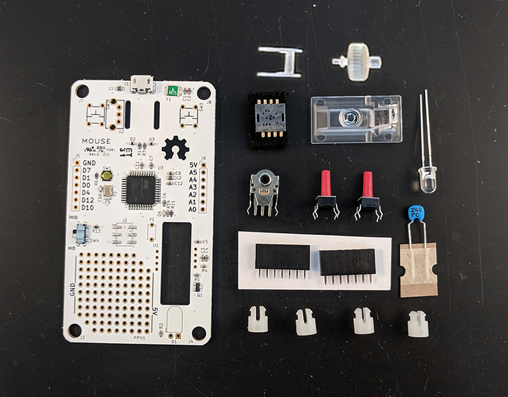

* 1 PCB populated with SMT components
* 1 ADNS2026 Optical Mouse sensor
* 1 Clear plastic lens for ADNS sensor
* 1 Mouse Wheel encoder
* 2 Red pushbutton switches
* 2 7 pin female headers
* 1 24MHz resonator
* 4 plastic Feet
* 1 Mouse wheel
* 1 Mouse wheel holder

## Step One: ADNS2026 at U1

The ADNS2026 sensor has a small piece of kapton tape covering the lens. **Do Not** remove the kapton tape until directed to by these instructions. It will protect the lens from any random goo or dust getting in there.

Solder the ADNS2026 optical sensor. It is **VERY** important that this part gets soldered at the right height on the board! Incorrect vertical position of the ADNS will cause the mouse to fail!

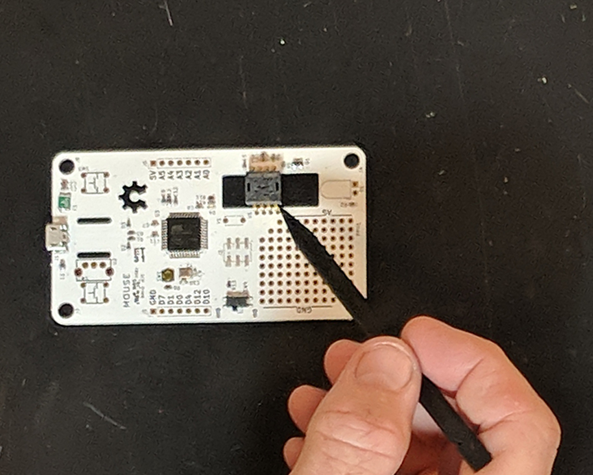
Place the PCB flat side down on a smooth surface, and then put the ADNS legs into the PCB holes. Make sure that the ends of the ADNS legs are touching the surface of the table. The ADNS will be 'standing up' above the PCB. **NOTE THE ORIENTATION OF THE ADNS!** Pin 1 is marked by a small round circle in one corner of the IC, and Pin 4 is marked by the large round circle that I'm pointing to.

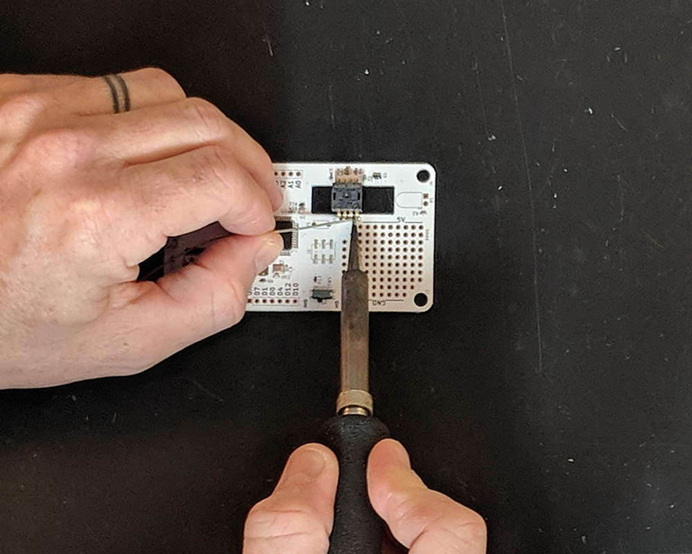
Once you have the part oriented correctly and the legs are touching the table top through the PCB holes with the PCB flat on the table top, go ahead and solder each leg from the top.

## Step Two: Resonator at Y1

The blue resonator fits in right next to the ADNS and it doesn't have any orientation. It can go either direction.

## Step Three: LED at D1
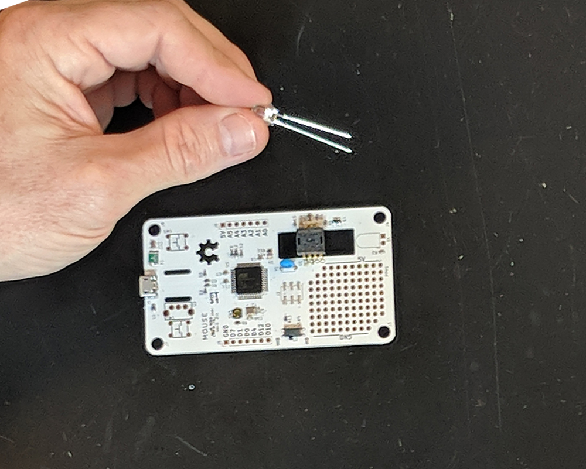
The LED is oriented with the long leg toward the middle of the board.

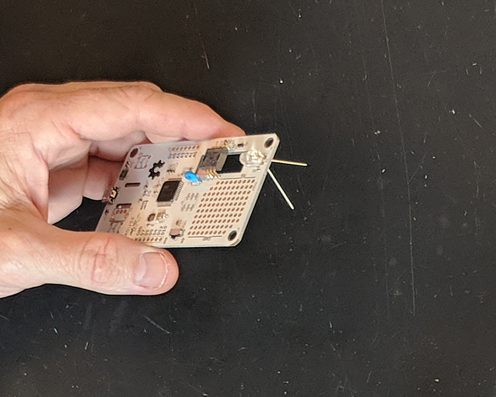
 The leads of the LED need to be bent at 90 degrees so that it will point toward the ADNS sensor.

## Step Four: Headers at J5 and J6
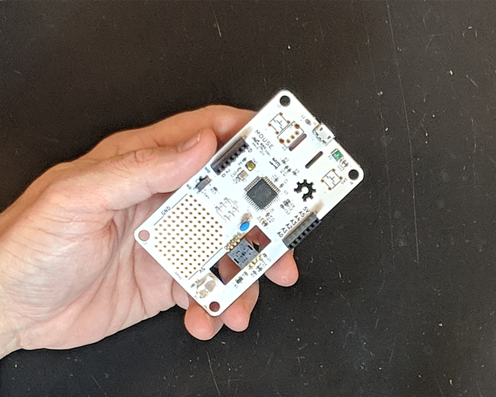
Next, solder in the two 7 pin female headers. The PCB should sit flat on them upside down for easy soldering. Get one leg of each header soldered, and then turn over to board to make sure that the headers are sitting straight. Adjust as necessary by remelting the pin you soldered, then solder the rest of the pins.

## Step Five: Encoder at U2

The encoder for the mouse wheel only goes in one way. There are two large clip leads on the sides. **Make sure that the encoder is inserted all the way** so that the base of the encoder sides is touching the top of the PCB.

This will ensure that the wheel and wheel support will fit correctly later.

## Step Six: Buttons at SW2 and SW3
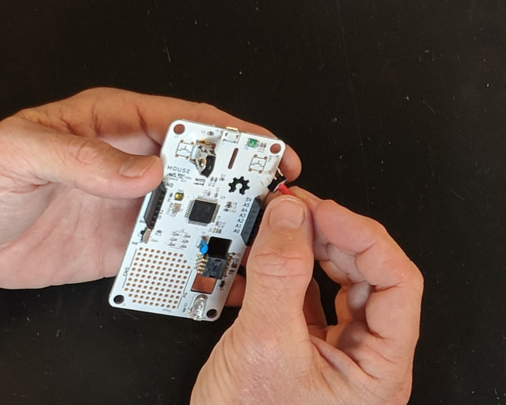
The two pushbutton switches only fit one way. The legs will snap into the PCB and hold them there for you to solder them.

## Step Seven: Lens

Now it's time to attach the clear plastic lens to the bottom of the board. **FIRST REMOVE THE KAPTON TAPE**. Use a pair of tweezers or your fingernail to peel off the kapton tape that covers the ADNS lens.

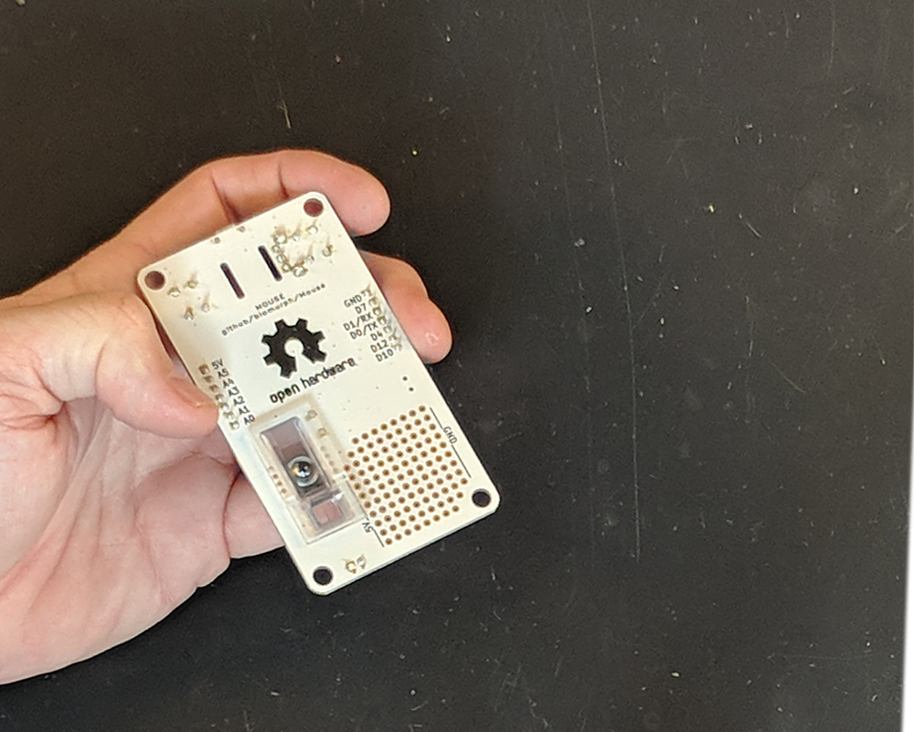
Then, orient the lens so that the triangular prism is on the side with the LED.

The lens should fit flat against the ADNS lens.

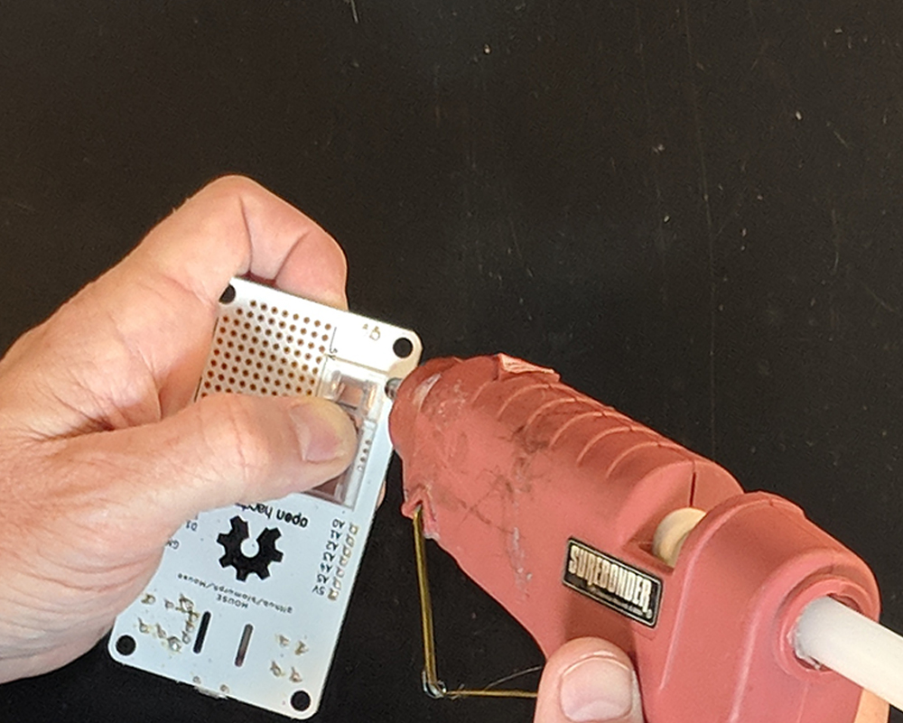
I'm using hot glue to secure the lens to the bottom of the PCB. **DO NOT USE CYANOACRYLATE OR CRAZY GLUE IT WILL RUIN THE LENS!**

## Step Eight: Feet
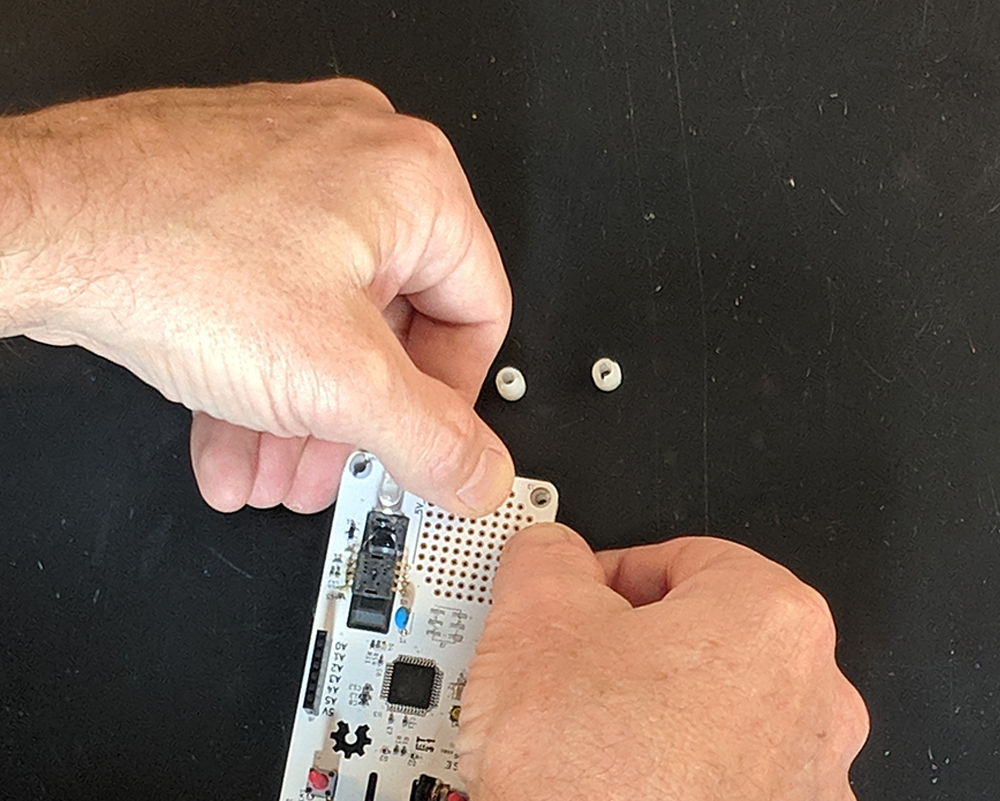
Attach the feet to the PCB from the bottom. Place the feet upright on a table and press the PCB onto them until they snap into the holes.

## Step Nine: Wheel
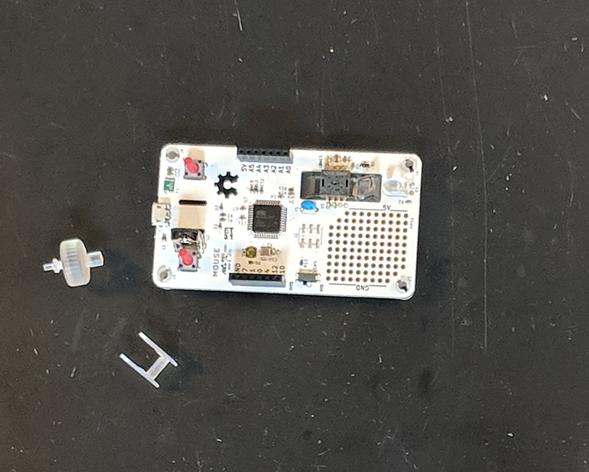
The clear mouse wheel has a small hex shaft on one end which fits perfectly into the hex hub of the encoder.

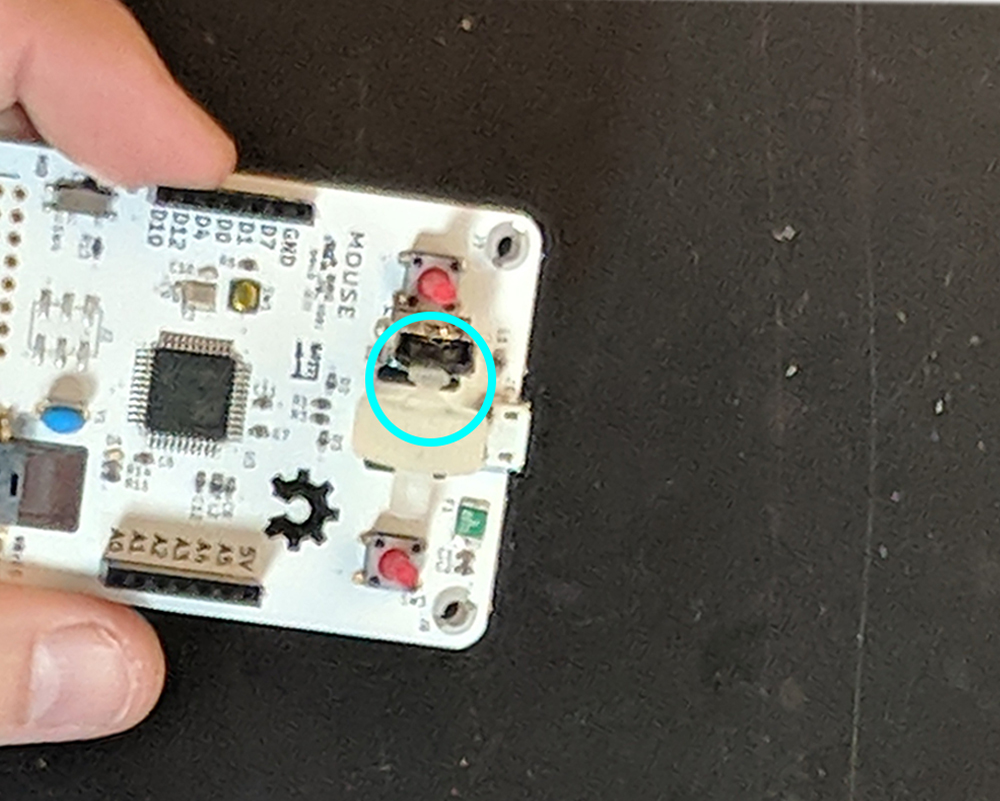
Slide the mouse wheel shaft into the encoder hub.

Then, insert the mouse wheel holder into the slots from the bottom of the PCB. ***be careful when doing this*** the parts have a snug fit, and if the cradle is not lined up with the wheel hub it might damage the wheel!

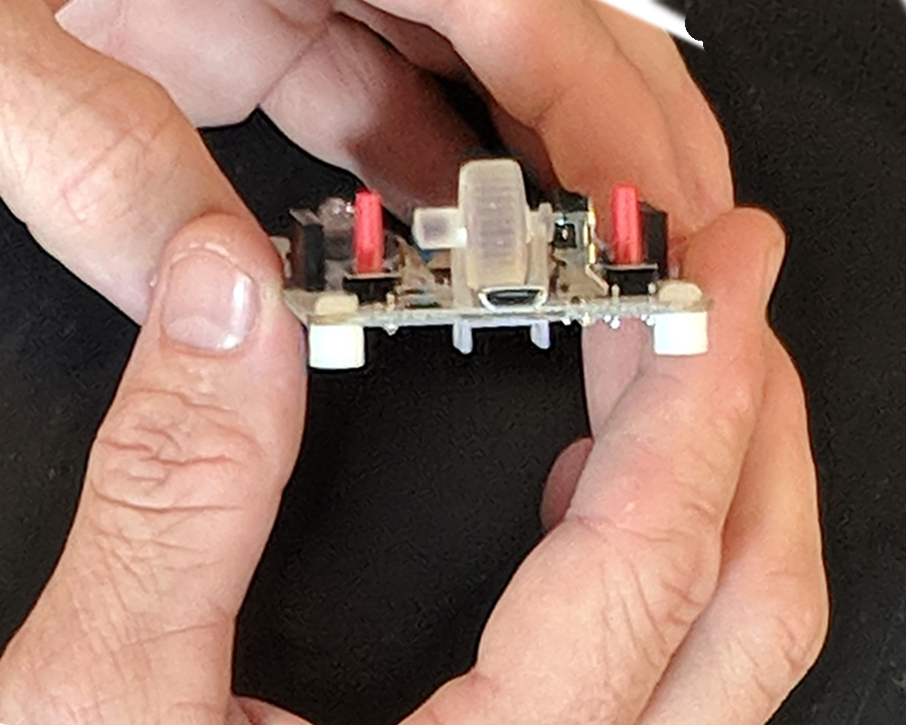
The holder will snap into place, and cradle the wheel axle on both sides.

# Use Your Mouse
This open-source computer mouse is built around an ATmega32u4 with the Arduino Leonardo bootloader. It has already been programmed with the example sketch from the Mousey library. There are two modes of operation HID and Not-HID. Modes are selected using the slide switch on the left side of the mouse.

## HID Mode
When the slide switch is on the side closest to the pad per hole prototyping area (aka DOWN), the mouse is in HID mode. When plugged into a micro USB cable, the mouse will read the sensors (wheel, buttons, optical sensor), and function just like a mouse attached to your computer!

## Not-HID Mode
When the slide switch is on the side closest to the 7 pin female header (aka UP), the mouse is in the Not-HID mode. When plugged into a micro USB cable, the mouse will read the sensors (wheel, buttons, optical sensor) and send the data it gets over serial at 115200 baud. You can open any serial terminal to view the data from the mouse.

## Troubleshooting
The mice were packaged with the HID select switch in the HID position. If you plug your mouse in to a computer and it doesn't work like a mouse should, then check to make sure that the HID switch is in HID mode. The small tact switch labeled `SW1` is the reset button for the Leonardo. You can switch modes on the fly, and press this reset button to change modes without unplugging your mouse. If all else fails, re-program the mouse with the OpenMouse.ino code from the example in the Mousey Library.
